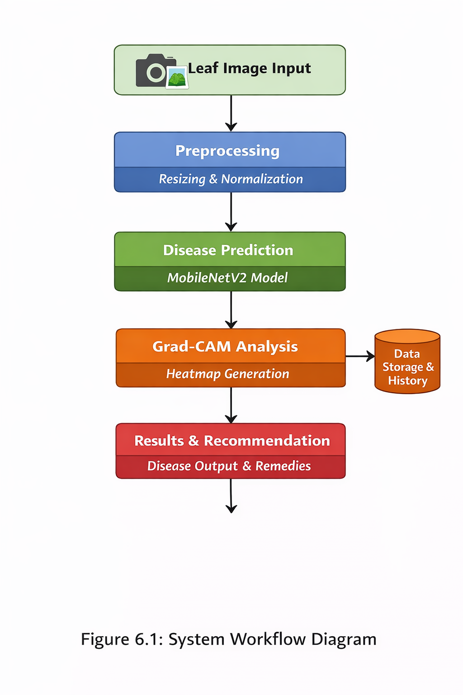
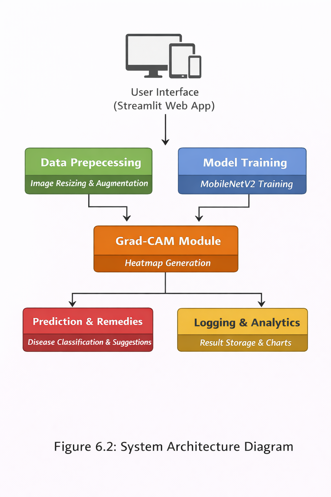

(venv) PS D:\plant_disease_detection> streamlit run app.py

  You can now view your Streamlit app in your browser.

  Local URL: http://localhost:8501
  Network URL: http://10.12.13.249:8501

2025-12-24 12:56:24.550489: I tensorflow/core/util/port.cc:113] oneDNN custom operations are on. You may see slightly different numerical results due to floating-point round-off errors from different computation orders. To turn them off, set the environment variable `TF_ENABLE_ONEDNN_OPTS=0`.
WARNING:tensorflow:From D:\plant_disease_detection\venv\Lib\site-packages\keras\src\losses.py:2976: The name tf.losses.sparse_softmax_cross_entropy is deprecated. Please use tf.compat.v1.losses.sparse_softmax_cross_entropy instead.

WARNING:tensorf

## 🧠 System Architecture

### System Workflow

### System Design

# 🌿 Plant Disease Detection using AI and ML

## 🧩 About the Project
An AI-powered system designed to detect plant leaf diseases using deep learning techniques.  
The model is built on **MobileNetV2**, achieving **94.7% accuracy** on the PlantVillage dataset.  
It integrates **Grad-CAM** for explainable AI visualization, highlighting infected regions on leaves.  
The interactive **Streamlit web application** allows users to upload images, view predictions, visualize Grad-CAM heatmaps, and get remedy suggestions for detected diseases.  

### 🔍 Key Features
- Detects plant diseases from uploaded leaf images.  
- Provides confidence score and disease name.  
- Displays Grad-CAM heatmap for explainable results.  
- Suggests treatment remedies (organic and chemical).  
- Includes class distribution chart and prediction history.  

### 🧠 Technologies Used
- **Python**, **TensorFlow/Keras**, **OpenCV**, **Streamlit**, **NumPy**, **Pandas**, **Matplotlib**  
- **Model:** MobileNetV2 (Fine-tuned on PlantVillage dataset)  
- **Explainability:** Grad-CAM Visualization  
- **Deployment:** Streamlit Cloud  

---

